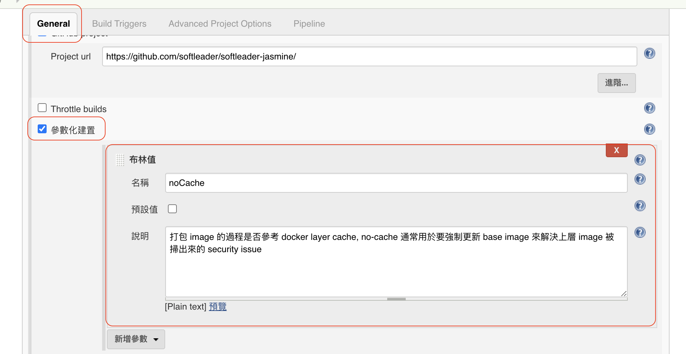

# JRE Base Image

公司有維護 JRE Base Image, 包含了 Java 8, Java 11 等在公司專案中常用的 JRE 版本, 再多做些如 TimeZone 等常見的共通性設定, 一共有以下版本:

- [Azul Zulu](https://github.com/softleader/dockerfile/tree/master/azul-zulu)
- [AdoptOpenJDK](https://github.com/softleader/dockerfile/tree/master/adoptopenjdk)

## Harbor Registry

公司維護的 JRE Base Image 都收錄於 [Harbor Registry](https://harbor.softleader.com.tw/), 名稱為:

- **harbor.softleader.com.tw/library/zulu-openjdk-alpine**
- **harbor.softleader.com.tw/library/adoptopenjdk-alpine**

你可以透過 docker 指令拉取, 如:

```sh
# Azul Zulu
docker pull harbor.softleader.com.tw/library/zulu-openjdk-alpine:11-jre-taipei

# AdoptOpenJDK
docker pull harbor.softleader.com.tw/library/adoptopenjdk-alpine:11-jre-taipei
```

要查檢視所有 Tag 請點:

- [Azul Zulu Tags](https://harbor.softleader.com.tw/harbor/projects/251/repositories/zulu-openjdk-alpine)
- [AdoptOpenJDK Tags](https://harbor.softleader.com.tw/harbor/projects/251/repositories/adoptopenjdk-alpine)

## Nightly Build

為了能盡快套用上層的 Azul Zulu / AdoptOpenJDK Image 或 OS Package 的 Security Issue Fix Pack, 我們使用 [GitHub Action](https://github.com/softleader/dockerfile/blob/master/.github/workflows) 在每天晚間會自動的重 Build 這些 JRE Base Image

若你真的很急想要立馬重 Build, 你可以:

1. 到 [softleader/dockerfile/actions](https://github.com/softleader/dockerfile/actions/workflows/azul.yml) 點選 **Run workflow**
2. 若上述沒權限, 也可以 checkout [softleader/dockerfile](https://github.com/softleader/dockerfile) 專案, 執行  `azul-zulu/build-image-no-cache.sh` 或 `adoptopenjdk/build-image-no-cache.sh`

## Vulnerability Scan

我們採用 [Trivy](https://github.com/aquasecurity/trivy) 做為 Image 安全掃描機制, 在每天午夜自動的掃描所有 Harbor Registry 上的 Image,  包含了 Base JRE Image 及使用這些 Base JRE Image 的專案 Image 等

專案的 Image 只要打包過, 在同一個環境的 Docker 會 cache 這些上層的 Image 及 Layers, 若想套用公司最新的 JRE Base Image 或 OS Package 的這些 Fix Pack, 則專案 Image 就必須要重新打包, 並且提醒 Docker 要重新拉取 Base Image (`--pull`) 及忽略 Cach Layer (`--no-cache`), 如:

```sh
docker build harbor.softleader.com.tw/${my-project}/${my-image}:${my-tag} \
	--pull \
	--no-cache \
	--push
```

### Jenkins Setting

大部分我們的專案都是使用 Jenkins 作為 CI/CD 工具, 因此要稍作調整, 首先修改 Jenkinsfile, 找到打包 Image 步驟, 將其中的打包語法一樣加上 `--no-cache` 及 `--pull`:

```groovy
stage('docker build') {
    steps {
        sh "docker build --no-cache=${noCache} --pull=${noCache} -t harbor.softleader.com.tw/jasmine/${env.JOB_NAME}:${tag} . -f Dockerfile-ocp"
        sh "docker build --no-cache=${noCache} --pull=${noCache} -t hub.softleader.com.tw/${env.JOB_NAME}:${tag} ."
    }
}
```

接著到 Jenkins 的設定畫面, 點選 Job > General 中的參數化建置區塊, 增加 `noCache` 名稱的布林值參數, 說明打上:

```
打包 image 的過程是否參考 docker layer cache, noCache 通常用於要強制更新 base image 來解決上層 image 被掃出來的 security issue
```



這樣完成後, 只要在打包 Image 時打勾 `noCache`, 即可套用當前所有的 Security Issue Fix Pack!

### Containerize Tool

如果專案使用的是 [Jib](https://github.com/GoogleContainerTools/jib) 或是 [Buildpacks](https://buildpacks.io/) 等 Image 打包工具, 則應該都不用特別去處理, 因為這些工具通常預設都會去檢查 Base Image 是否有任何更新!
